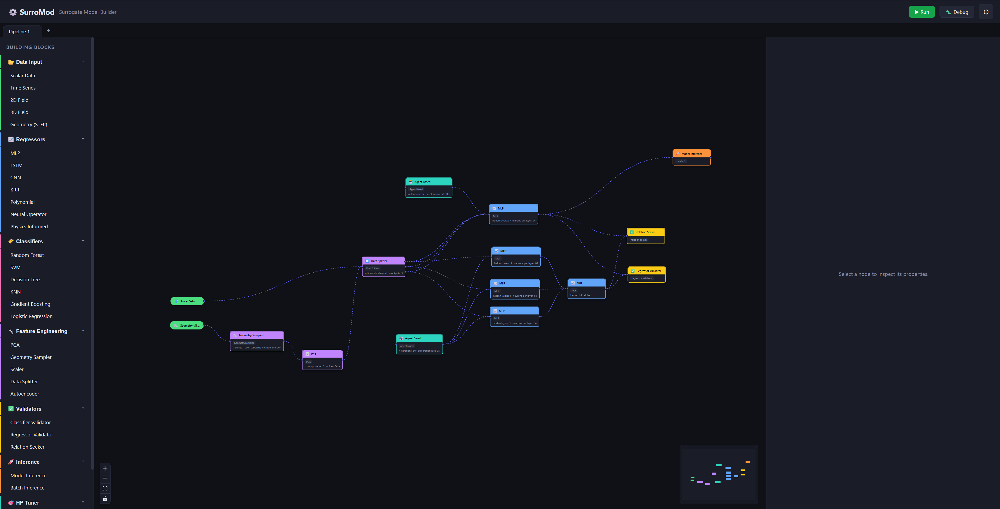

<p align="center">
  <picture>
    <source srcset="./doc/pics/surromod_logo_dark.svg" media="(prefers-color-scheme: dark)">
    <source srcset="./doc/pics/surromod_logo_light.svg" media="(prefers-color-scheme: light)">
    
  </picture>
</p>

# Development 

Visual workflow builder for surrogate models. Drag-and-drop ML pipelines on a canvas -- regressors, classifiers, feature engineering, validation, innovative agent based hp tuning -- then execute thepipeline from data loading (CAD geometries, scalar, matrices, tensors etc.) to model evaluation and production ready models.

Built with React / React Flow (frontend) and Python (backend).

Current phase of the project focuses on the use-ability of the frontend - backend is started for MLP pipeline.
Target is to work on frontend until I am satisfied and then wire as lean and adaptiv as possible into the full integrated backend. Builds on top of pytorch and scikit learn.

## Screenshot



## Video of simple Neural Network (MLP) Training on concrete dataset comparing two feature enginenring approaches - working


## Video of advanced workflow - concept


## Quick Start

```bash
python launcher.py             # install deps + start dev server
python launcher.py --install   # force reinstall npm dependencies
python launcher.py --build     # production build
```

Requires Node.js >= 18 and Python >= 3.10.

## Project Layout

```
launcher.py                         Entry point (starts backend + Vite dev server)
src/
  frontend/                         React + TypeScript UI
    App.tsx                          Shell: tab bar, header, run button, settings modal
    store.ts                         Zustand state (tabs, nodes, edges, theme, pipeline run)
    types.ts                         Shared type definitions
    utils.ts                         Palette items, hyperparameter defaults
    api.ts                           Backend communication stubs
    styles.css                       Global styles, dark/light theme
    vite.config.ts                   Vite config with /api proxy to backend
    components/
      Canvas.tsx                     Sidebar + React Flow canvas
      Inspector.tsx                  Right panel: node properties, hyperparams, validator results
      nodes/
        InputNode.tsx                Scalar, Time Series, 2D Field, 3D Field, Geometry (STEP)
        RegressorNode.tsx            MLP, LSTM, CNN, KRR, Polynomial, Neural Operator, PINN
        ClassifierNode.tsx           Random Forest, SVM, Decision Tree, KNN, Gradient Boosting, Logistic Regression
        FeatureEngineeringNode.tsx   PCA, Geometry Sampler, Scaler, Data Splitter, Autoencoder
        ValidatorNode.tsx            Classifier/Regressor Validator, Relation Seeker
        InferenceNode.tsx            Model Inference, Batch Inference
        HPTunerNode.tsx              Grid Search, Agent Based, Optimiser Based

  backend/                           Python / FastAPI processing
    server.py                        FastAPI REST server (pipeline/run, csv/columns, health)
    pipeline_executor.py             Topological sort + node execution routing
    data_digester/                   Data loading per modality (scalar_data_digester, time_series_digester 2d_data_digester,          
                                     3d_data_digester, step_data_digester for CAD geometries – STEP / STL)
    predictors/
      model_base.py                  Abstract base with registry, factory, lifecycle
      regressors/                    mlp, lstm, cnn, krr, polynomial, neural_operator, pinn
      classifiers/                   random_forest, svm, decision_tree, knn, gradient_boosting, logistic_regression
    feature_engineering/             pca, geometry_sampler, scaler, data_splitter, autoencoder
    inference/                       model_inference, batch_inference
    analyzers/                       classifier_validator, regressor_validator, relation_seeker
    hp_tuner/                        grid_search, agent_based, optimiser_based

data/                               Sample datasets (concrete_data.csv, NYC.csv)
test/
  testsuite.py                       Test runner
```

## Implemented models and nodes

- **Frontend nodes (UI implemented):** Data Input, Regressor, Classifier, Feature Engineering, Validator, HPTuner, Inference (components in `src/frontend/components/nodes`).
- **Backend regressors (implemented):** `MLP` (`src/backend/predictors/regressors/mlp.py`), `KRR` (`src/backend/predictors/regressors/krr.py`).
- **Backend regressors (not implemented in DEMO):** `CNN`, `LSTM`, `Polynomial`, `NeuralOperator`, `PINN` .
- **Backend classifiers (not implemented in DEMO):** `RandomForest`, `SVM`, `DecisionTree`, `KNN`, `GradientBoosting`, `LogisticRegression`.
- **Feature engineering (implemented):** `PCA`, `Scaler`, `Autoencoder` (`src/backend/feature_engineering`).
- **Feature engineering (not implemented in DEMO):** `DataSplitter`, `GeometrySampler` 
- **Validators:** `RegressorValidator` implemented; `ClassifierValidator` & `RelationSeeker` are not implemented in DEMO.
- **HP tuners: (not implemented in DEMO)** 
- **Inference: (not implemented in DEMO)** 

Note: files that are simple placeholders or contain only `pass` are listed above as "stubs / not implemented yet" — backend functionality is a work in progress.

