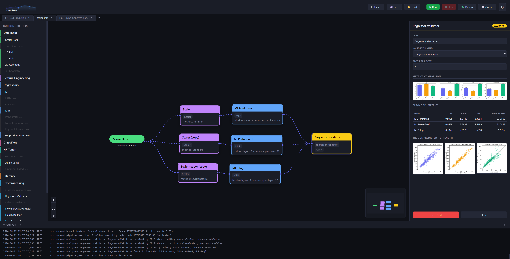
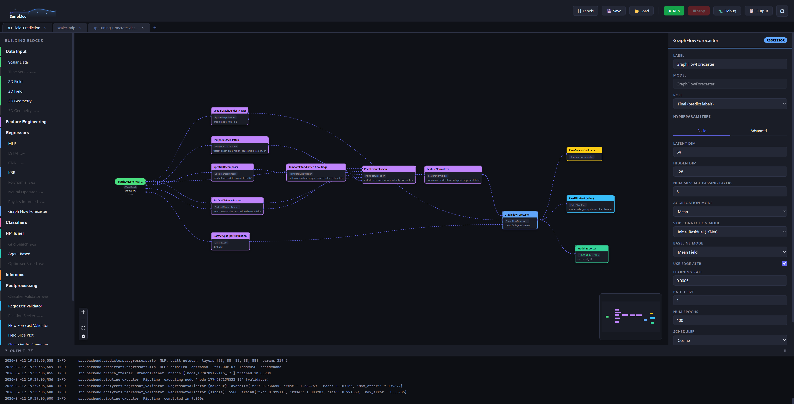
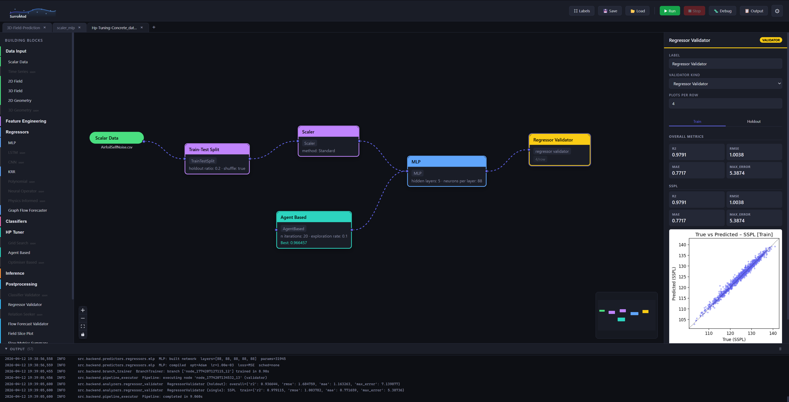

<p align="center">
  <picture>
    <source srcset="./doc/pics/surromod_logo_dark.svg" media="(prefers-color-scheme: dark)">
    <source srcset="./doc/pics/surromod_logo_light.svg" media="(prefers-color-scheme: light)">
    
  </picture>
</p>

# SurroMod — Visual Surrogate Model Builder

Visual workflow builder for surrogate models. Drag-and-drop ML/Surrogate pipelines on a canvas — regressors, feature engineering, HP tuning, postprocessing, GNN-based flow prediction — then execute the full pipeline from raw data to trained model and export.

I have read many papers where I always learned the most by looking at the visual abstract - I am a strongly visual learning type . I want to create an environment in which one can draw such a visual abstract with nice features such as an agent working on top, replacing costly HP tuning with an agent-based approach using just a few evaluations. Furthermore, I want to develop agent-based surrogate modeling using reliable building blocks.

Built with React / React Flow (frontend) and Python / FastAPI (backend).

## Comparing Scaler Methods on MLPs



## 3D Field prediction pipeline 



## Youtube Video showing Agent based HP Tuning (click on picture below to open)

[](https://www.youtube.com/watch?v=hb4ld41qEW0)

## Quick Start

```bash
python launcher.py             # install deps + start dev server
python launcher.py --install   # force reinstall npm dependencies
python launcher.py --build     # production build
```

Requires Node.js >= 18 and Python >= 3.10.

---

## Project Layout

```
launcher.py                              Entry point (starts backend + Vite dev server)
src/
  frontend/                              React + TypeScript UI
    App.tsx                              Shell: tab bar, header buttons, settings modal
    store.ts                             Zustand state (tabs, nodes, edges, theme, pipeline, labels toggle)
    types.ts                             Shared TypeScript type definitions
    utils.ts                             Palette items, hyperparameter defaults, category colours
    api.ts                               Backend API calls (upload, save/load workflow, pipeline run)
    styles.css                           Global styles, dark/light theme, node + handle CSS
    components/
      Canvas.tsx                         Sidebar palette + React Flow canvas
      Inspector.tsx                      Right panel: node properties, hyperparams, validator results
      HPTunerAnalytics.tsx               Live iteration chart and best-config display for HP tuning
      OutputPanel.tsx                    Collapsible log/output stream panel
      nodes/
        InputNode.tsx                    Scalar, 2D Field, 3D Field (Temporal Point Cloud), Geometry
        RegressorNode.tsx                MLP, KRR, GraphFlowForecaster + stubs
        ClassifierNode.tsx               RandomForest, SVM, DecisionTree, KNN, GradientBoosting, LR
        FeatureEngineeringNode.tsx       All FE methods with named multi-port handles
        ValidatorNode.tsx                Regressor/Classifier/FlowForecast validators
        InferenceNode.tsx                Standard inference + flow model inference
        HPTunerNode.tsx                  Grid Search, Agent Based, Optimiser Based
        RBLNode.tsx                      Residual-Based Learning node
        RBLAggregatorNode.tsx            Aggregates base + residual predictions
        PostProcessingNode.tsx           Field Slice Plot, Flow Metrics, Comparison Report, Validators
        CodeExporterNode.tsx             Generates standalone Python training script
        GRAMExporterNode.tsx             Model Exporter — packages model for GRaM @ ICLR 2026

  backend/                               Python / FastAPI processing
    server.py                            FastAPI server — pipeline/run, hp-tuner, export, workflow save/load
    pipeline_executor.py                 Topological sort + per-node execution routing
    branch_trainer.py                    Multi-branch / residual pipeline trainer
    code_generator.py                    Generates standalone Python training scripts from workflow
    data_digester/
      scalar_data_digester.py            CSV / HDF5 scalar datasets
      two_d_data_digester.py             2D spatial field data
      temporal_point_cloud_field_digester.py  Temporal point-cloud fields (warped-ifw batch loader)
      geometry_2d_digester.py            2D geometry / shape representations
      validators.py                      Input data validation helpers
    feature_engineering/
      pca.py                             PCA dimensionality reduction
      scaler.py                          MinMax / Standard / LogTransform scaler
      autoencoder.py                     Deep autoencoder (PyTorch)
      dataset_split.py                   Train/val/test split for scalar and 3D field data
      feature_normalizer.py              Per-component or global feature normalisation
      spatial_graph_builder.py           k-NN / radius graph construction (PyG edge_index + edge_attr)
      surface_distance_feature.py        Signed/unsigned distance to surface + geometry mask
      temporal_stack_flatten.py          Flatten time-series field into feature vectors
      point_feature_fusion.py            Fuse position, velocity history, geometry, spectral features
      spectral_decomposer.py             FFT / wavelet decomposition into low/high-frequency bands
      hierarchical_graph_builder.py      Multi-scale graph (fine + coarse) for hierarchical U-Net
      temporal_xlstm_encoder.py          xLSTM-based temporal encoder for velocity sequences
      rbl.py                             Residual-Based Learning node + aggregator
    predictors/
      model_base.py                      Abstract base with registry, factory, lifecycle hooks
      regressors/
        mlp.py                           Multi-layer perceptron (implemented)
        krr.py                           Kernel Ridge Regression (implemented)
        graph_flow_forecaster.py         GNN-based flow forecaster with hierarchical U-Net + xLSTM (implemented)
        flow_loss.py                     Custom flow prediction loss (proximity + MSE)
        cnn.py / lstm.py / polynomial.py / neural_operator.py / pinn.py  (stubs)
      classifiers/
        random_forest.py / svm.py / decision_tree.py / knn.py / gradient_boosting.py / logistic_regression.py  (stubs)
    analyzers/
      regressor_validator.py             True-vs-predicted plots, R², MAE, RMSE per label
      classifier_validator.py            Accuracy, confusion matrix (stub)
      relation_seeker.py                 Feature correlation analysis (stub)
    hp_tuner/
      agent_based.py                     LLM agent-based HP optimisation with GPU support (implemented)
      grid_search.py                     Exhaustive grid search (stub)
      optimiser_based.py                 Bayesian / TPE optimisation (stub)
    postprocessing/
      field_slice_plot.py                2D slice visualisation + video comparison mode
      flow_metrics_summary.py            Per-timestep / per-component flow error metrics
      flow_forecast_validator.py         GFF prediction validation with visual output
      prediction_comparison_report.py    Side-by-side training history + slice plots
    inference/
      flow_model_inference.py            GFF model inference on new point-cloud data (implemented)
      gram_exporter.py                   Packages trained GFF for GRaM @ ICLR 2026 submission
      model_inference.py                 Standard model inference (stub)
      batch_inference.py                 Batch inference (stub)

workflows/
  3D-Field-Prediction_3535b822.pkl      Reference 3D flow prediction pipeline (warped-ifw / GRaM)
data/                                   Sample datasets (concrete_data.csv, NYC.csv)
test/
  testsuite.py                          Integration test runner
  test_workflows/                       Workflow PKL fixtures
```

---

## Implemented Building Blocks

### Data Input
| Node | Status |
|---|---|
| Scalar (CSV / HDF5) | ✅ |
| 2D Field | ✅ |
| 3D Field — Temporal Point Cloud (warped-ifw batch) | ✅ |
| 2D Geometry | ✅ |
| Time Series | stub |
| 3D Geometry | stub |

### Feature Engineering
| Node | Status |
|---|---|
| PCA | ✅ |
| Scaler (MinMax / Standard / LogTransform) | ✅ |
| Autoencoder | ✅ |
| Dataset Split (scalar + 3D field, random / stratified) | ✅ |
| Feature Normalizer | ✅ |
| Spatial Graph Builder (k-NN / radius, PyG) | ✅ |
| Surface Distance Feature | ✅ |
| Temporal Stack Flatten | ✅ |
| Point Feature Fusion | ✅ |
| Spectral Decomposer (FFT / wavelet) | ✅ |
| Hierarchical Graph Builder (fine + coarse U-Net) | ✅ |
| Temporal xLSTM Encoder | ✅ |
| RBL / RBL Aggregator (residual-based learning) | ✅ |
| Geometry Sampler | stub |

### Regressors
| Model | Status |
|---|---|
| MLP | ✅ |
| KRR | ✅ |
| GraphFlowForecaster (hierarchical U-Net + xLSTM + proximity loss) | ✅ |
| LSTM / CNN / Polynomial / Neural Operator / PINN | stub |

### HP Tuning
| Method | Status |
|---|---|
| Agent Based (LLM-driven, GPU-aware, live analytics) | ✅ |
| Grid Search | stub |
| Optimiser Based (Bayesian / TPE) | stub |

### Postprocessing & Validation
| Node | Status |
|---|---|
| Regressor Validator (R², MAE, RMSE, true-vs-pred plots) | ✅ |
| Flow Forecast Validator | ✅ |
| Field Slice Plot (static + video comparison) | ✅ |
| Flow Metrics Summary | ✅ |
| Prediction Comparison Report | ✅ |
| Classifier Validator / Relation Seeker | stub |

### Inference & Export
| Node | Status |
|---|---|
| Flow Model Inference (GFF) | ✅ |
| Code Exporter (generates standalone `train.py`) | ✅ |
| Model Exporter (GRaM @ ICLR 2026 package + optional PR) | ✅ |
| Standard / Batch Inference | stub |

---

## UI Features

- **Multi-tab canvas** — run independent pipelines side by side
- **Drag-and-drop sidebar** — organised sections: Data Input, Feature Engineering, Regressors, Classifiers, HP Tuner, Inference, Postprocessing, Exporters
- **Named multi-port handles** — nodes expose typed input/output ports (e.g. `pos`, `edge_index`, `point_features`); toggle visibility with the **⌗ Labels** button in the header
- **Live HP tuning analytics** — iteration score chart + best config table updated in real time
- **Resizable inspector** — drag the divider to adjust the right-hand property panel
- **Undo / Redo** — Ctrl+Z / Shift+Ctrl+Z across all canvas edits
- **Copy / Paste** — Ctrl+C / Ctrl+V for selected nodes and their internal edges
- **Output log panel** — collapsible streaming log from the backend
- **Dark / Light theme** + global random seed for reproducible training runs
- **Save / Load** — workflows serialised as `.pkl` files

---

## Reference Workflow — 3D Flow Prediction

`workflows/3D-Field-Prediction_3535b822.pkl` is a complete GNN-based aerodynamic flow prediction pipeline:

```
BatchDigester (warped-ifw)
  ├─ pos ──► SpatialGraphBuilder (k-NN)  ──► edge_index ──► GraphFlowForecaster
  ├─ pos ──► SurfaceDistanceFeature ─┬─ dist ──► PointFeatureFusion
  │                                  └─ mask ──► PointFeatureFusion
  ├─ velocity_in ──► TemporalStackFlatten ──► PointFeatureFusion
  ├─ velocity_in ──► SpectralDecomposer ──► TemporalStackFlatten (low-freq) ──► PointFeatureFusion
  ├─ pos ──► PointFeatureFusion
  └─ data ──► DatasetSplit ─────────────────────────────────► GraphFlowForecaster
                                PointFeatureFusion ──► FeatureNormalizer ──► GraphFlowForecaster
  GraphFlowForecaster ──► FlowForecastValidator
                      ──► FieldSlicePlot (video comparison)
                      ──► Model Exporter (GRaM)
```

---

## Generating Third-Party License Files

```bash
# Backend
pip-licenses --with-system --with-license-file --output-file THIRD-PARTY-BACKEND.txt

# Frontend
npx license-checker --summary --production > ../../THIRD-PARTY-FRONTEND.txt
```
