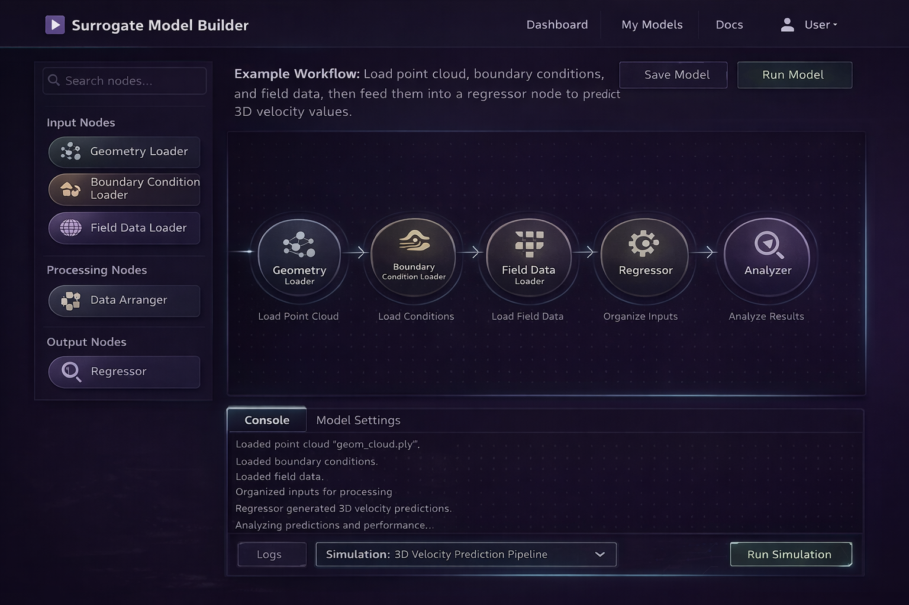

# SurroMod

A visual workflow builder for creating and validating machine learning surrogate models (SciKit-Learn and PyTorch).

## Purpose

Build ML pipelines through a drag-and-drop canvas interface. Train regressors and classifiers on diverse data types — 3D field data from simulations, CAD geometries, images, time series, scalars — then validate and analyze relationships without or with writing code.

## Structure

### Backend (`src/backend/`)
- **data_digester/**: Processors for 2D/3D field data (simulations, images), CAD data, scalars, time series, and step data
- **predictors/**: Regressors and classifiers specialized for each data type (field-based, scalar, temporal)
- **analyzers/**: Model validation and relationship analysis tools
- **nodes/**: Input, manipulation, and output node logic

### Frontend (`src/frontend/`)
- **index.html, main.tsx, App.tsx**: Application entry points
- **components/**: Canvas workflow area, inspector panel, and visual node components
- **types.ts, store.ts**: Type definitions and state management
- **api.ts, utils.ts**: Backend communication and helper functions
- **styles.css**: Application styling

## This is a very bad illustration generated from a few even worse prompts:

## Workflow

1. Add input nodes to load data
2. Connect to predictor nodes (regressors/classifiers)
3. Attach validators to analyze performance
4. Execute the workflow and inspect results
